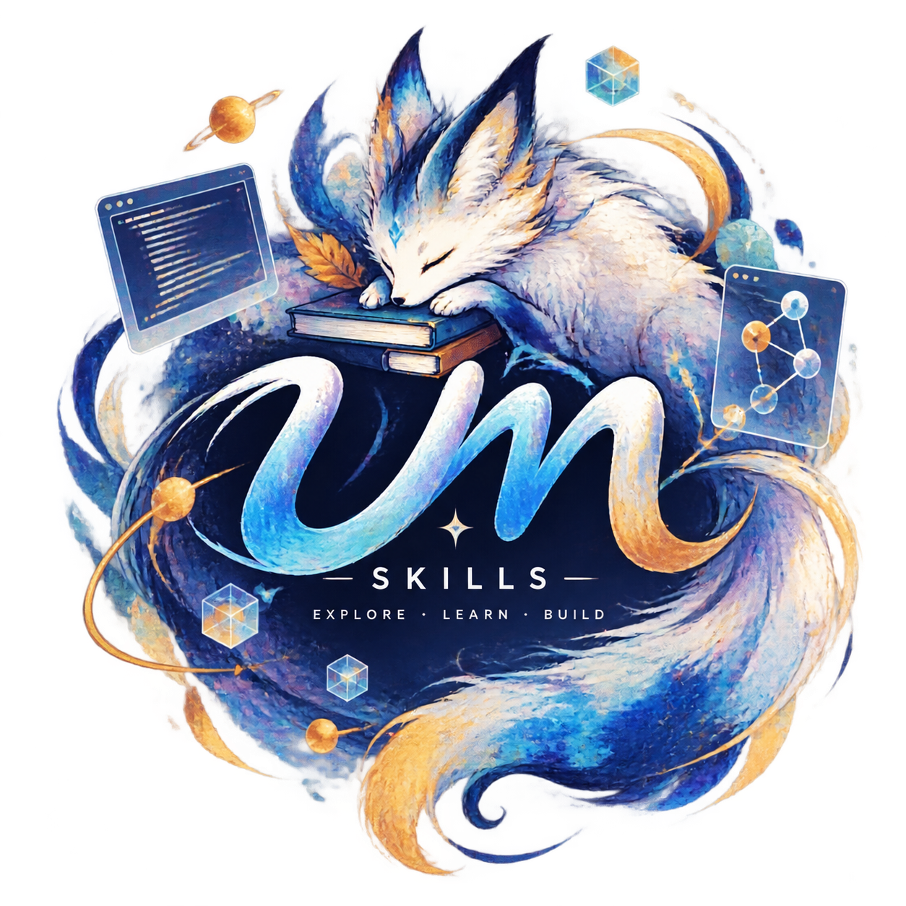

<div align="center">
  

  # UM Skills — Engineering Skill Chain Library

  <p align="center">
    <strong>Multi-environment (DSH / OpenCode / Codex) routable engineering skill chain library</strong><br>
    Plan → Commit → Release, with Review insertable at any stage
  </p>

  <p align="center">
    <b>English</b> · <a href="README.md">简体中文</a>
  </p>

  <p align="center">
    <a href="LICENSE">
      
    </a>
    <a href="https://github.com/unforgetmemory/um-skills">
      
    </a>
    <a href="https://ko-fi.com/unforgetmemory">
      
    </a>
    
    
  </p>
</div>

---

## 📋 Table of Contents

- [✨ Introduction](#-introduction)
- [🚀 Quick Start](#-quick-start)
- [🧩 Skills Overview](#-skills-overview)
- [🏗️ Architecture](#️-architecture)
- [📁 Project Memory](#-project-memory)
- [📚 Detailed Design](#-detailed-design)
- [🤝 Support the Project](#-support-the-project)
- [📄 License](#-license)

---

## ✨ Introduction

**UM Skills** is an engineering skill chain library for AI Agents, covering the full software development lifecycle:

| Stage | Skill | Responsibility |
|-------|-------|----------------|
| Plan → | **umpp** | Structured investigation and architecture-first execution for complex multi-step tasks |
| Commit → | **umcommit** | CHANGELOG audit + Conventional Commit + atomic commit + push |
| Release → | **umrelease** | CI dry-run gate + professional Release Notes + SemVer/CalVer versioning |
| Review ↔ | **umreview** | MRI-style five-axis code review + security audit + test coverage + cleanup |
| Analyze ↕ | **uma** | Read-only project analysis & explanation: structure, chains, reference points, refactor trade-offs, cross-language idioms |

Five professions form a complete engineering pipeline (with **uma** as an independent read-only lane usable at any stage), supporting **DSH** (DeepSeek Harness), **OpenCode**, and **Codex** AI Agent environments with automatic tool and capability routing.

> 💡 **Design Philosophy**: Software is a living organism, not a one-time modification. Abstraction emerges from real change (Evolution First). No layer absorbs the content of another; each subagent carries only its own chain's references.

---

## 🚀 Quick Start

### Install via skills CLI (vercel-labs, recommended)

```bash
npx skills add unforgetmemory/um-skills
```

> Umbrella single skill: the only skill directory `skills/um/` embeds the entry
> router, five profession route tables, and the single copies of
> references / adapters — one source of truth, zero duplication, install as-is
> ([ADR-003](docs/adr/ADR-003-umbrella-single-skill.md)).

### Deploy to DSH

```bash
cp -r skills/um ~/.dsh/skills/
```

### Deploy to OpenCode

```bash
cp -r skills/um ~/.opencode/skills/
```

### Usage

In any supported environment, speak the trigger words to your AI Agent to invoke the corresponding skill:

| Trigger | Effect |
|---------|--------|
| `umpp` | Start Planning: Problem Statement → Spec → TODO → Wave Execution → Verification |
| `umcommit` | Start Commit: CHANGELOG + audited commit + push (single decision panel) |
| `umrelease` | Start Release: CI dry-run gate → Release Notes → version tag → gh release |
| `umreview` | Start Review: MRI-style five-axis code review, no commit or push |
| `uma` | Start Analysis: read-only explanation of structure / chains / reference points / trade-offs, no code |

---

## 🧩 Skills Overview

> The five professions are consolidated into the single umbrella skill **um**
> ([ADR-003](docs/adr/ADR-003-umbrella-single-skill.md)): after install, trigger
> words route to the matching profession table below.

| Skill | Domain | One-liner | Documentation |
|-------|--------|-----------|---------------|
| [**umpp**](skills/um/professions/umpp.md) | 📐 Planning | Structured investigation and architecture-first execution for complex multi-step tasks | [Router](skills/um/professions/umpp.md) |
| [**umcommit**](skills/um/professions/umcommit.md) | ✅ Commit | CHANGELOG + audited commit + push (single decision panel, version-aware) | [Router](skills/um/professions/umcommit.md) |
| [**umrelease**](skills/um/professions/umrelease.md) | 🚀 Release | CI dry-run gate → Release Notes → SemVer/CalVer tag → gh release | [Router](skills/um/professions/umrelease.md) |
| [**umreview**](skills/um/professions/umreview.md) | 🔍 Review | MRI-style five-axis review + security/gitignore/test/cleanup, no commit or push | [Router](skills/um/professions/umreview.md) |
| [**uma**](skills/um/professions/uma.md) | 🔬 Analysis | Read-only project analysis & explanation: structure, chains, reference points, refactor trade-offs, cross-language idioms (region wiki memory, gitRef change-aware refresh) | [Router](skills/um/professions/uma.md) |

### Skill Chain

```
umpp (Planning) ──→ umcommit (Commit) ──→ umrelease (Release)
       ↑ Review (umreview) insertable at any stage
uma (read-only Analysis) ── independent lane, insertable at any stage
```

---

## 🏗️ Architecture

The project uses a **four-layer architecture** for progressive disclosure and on-demand loading:

```
┌───────────────────────────────────────────────────────────────┐
│  L0  Base Constraints Layer                                   │
│  um/references/ (6 files)                                     │
│  Meta-constraints · Environment Routing · Context Adaptation  │
│  Decision Panel · Subagent Orchestration · Project Memory     │
├───────────────────────────────────────────────────────────────┤
│  L1  Skill Orchestration Layer                                │
│  Entry SKILL.md + professions/ five router tables             │
│  umpp · umcommit · umrelease · umreview · uma                │
├───────────────────────────────────────────────────────────────┤
│  L2  Process Rules Layer                                      │
│  um/references/ (30 granular files)                           │
│  Each file = one independently delegatable task boundary      │
├───────────────────────────────────────────────────────────────┤
│  L3  Environment Tool Layer                                   │
│  um/adapters/{dsh,opencode,codex}/{tools,capabilities}.md     │
│  Platform tool mappings and capability profiles               │
└───────────────────────────────────────────────────────────────┘
```

### Key Mechanisms

- **Environment Routing** — Three-tier cost-increasing: system prompt features → tool signatures → ask + persist
- **Decision Panel** — Multi-question GUI dialog in one pass, version options auto-adapt (SemVer/CalVer)
- **Wave Iteration** — Step completeness first; the only degradation when capacity is low is finer waves, never skipping steps
- **Subagent Orchestration** — Decision tree dispatch, each subagent carries only its own chain's references
- **Umbrella Single Skill** — one skill `um` inside the unified top-level container: canonical is the artifact, single source of truth with zero duplication ([ADR-003](docs/adr/ADR-003-umbrella-single-skill.md))
- **uma Memory Octopus** — region wiki memory: gitRef change-aware on-demand refresh (FRESH = zero write), region locks against concurrent writes, answer evidence always from live reads ([ADR-004](docs/adr/ADR-004-uma-readonly-analysis.md))
- **Cache Stability** — Zero dynamic values in instruction text, stable KV Cache prefix

> 📖 See [ARCHITECTURE.md](ARCHITECTURE.md) for the complete architecture design.

---

## 📁 Project Memory

Each project root can have a `.um.agents/` directory for persisting engineering context:

```
.um.agents/
├── constraints/          Checked in (team shared)
│   ├── hardcode-index.md Hardcoded semantic index (never miss a version bump)
│   └── project-rules.md  Project-specific rules
├── memory/               Not synced (*.local.md: env detection, decision drafts, traps)
│   └── uma/              uma analysis cache (region wiki pages + index + locks, gitRef change-aware refresh)
```

- `constraints/` — Team shared, committed with the project
- `memory/` — Local only, not synced (self-contained `.gitignore`)

---

## 📚 Detailed Design

| Document | Content |
|----------|---------|
| [ARCHITECTURE.md](ARCHITECTURE.md) | Four-layer architecture, environment routing, decision panel, wave iteration, token budget, maintenance guide |
| [CHANGELOG.md](CHANGELOG.md) | Version history |
| [umpp/SKILL.md](skills/um/professions/umpp.md) | Planning skill router |
| [umcommit/SKILL.md](skills/um/professions/umcommit.md) | Commit skill router |
| [umrelease/SKILL.md](skills/um/professions/umrelease.md) | Release skill router |
| [umreview/SKILL.md](skills/um/professions/umreview.md) | Review skill router |
| [uma/SKILL.md](skills/um/professions/uma.md) | Analysis skill router |

---

## 🤝 Support the Project

If you find this project helpful, consider supporting it:

<p align="center">
  <a href="https://ko-fi.com/unforgetmemory">
    
  </a>
</p>

<p align="center">
  <a href="https://ko-fi.com/unforgetmemory">
    
  </a>
</p>

---

## 📄 License

This project is open source under the [MIT](LICENSE) License.

---

<div align="center">
  <sub>Built with ❤️ by <a href="https://github.com/unforgetmemory">unforgetmemory</a></sub>
</div>